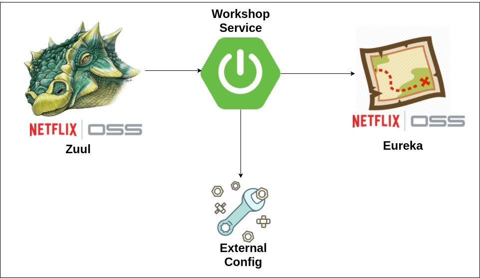

## F1 Workshop System
This project is a basic workshop crud system.

## Motivation
This project was created to be a simple example of how to use some of the netflixoss solutions.

## Diagram flow

## Tech/framework used

 * [Java 8](https://www.java.com/pt_BR/download/faq/java8.xml)
 * [Spring Boot](https://spring.io/projects/spring-boot)
 * [Zuul](https://github.com/Netflix/zuul)
 * [Eureka](https://github.com/Netflix/eureka)
